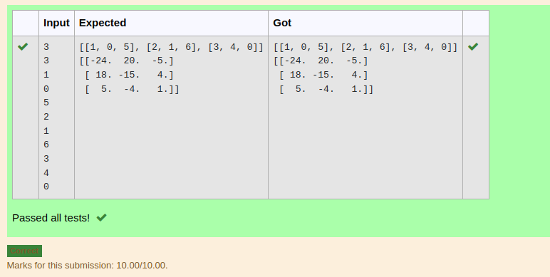

# Inverse-of-matrix

## AIM:
To write a python program to find the inverse of the matrix
## ALGORITHM:
Step 1:
Import numpy as np

Step 2:
Enter the input.

Step 3:
Use for loop and range.

Step 4:
Use np.linalg.inv() to find inver of a matrix.

Step 5:
Print()

## PROGRAM:
``` python
developed by : s.jegadeesh
registor number : 22004355
import numpy as np
r,c = int(input()),int(input())
l1,l2=[],[]
for i in range(r):
    for j in range(c):
        l1.append(int(input()))
    l2.append(l1)
    l1=[]
print(l2)
array1=np.array(l2)
arrayinverse=np.linalg.inv(array1)
print(arrayinverse)
```

## OUTPUT:


## RESULT:
Thus the program is written to find the matrix.